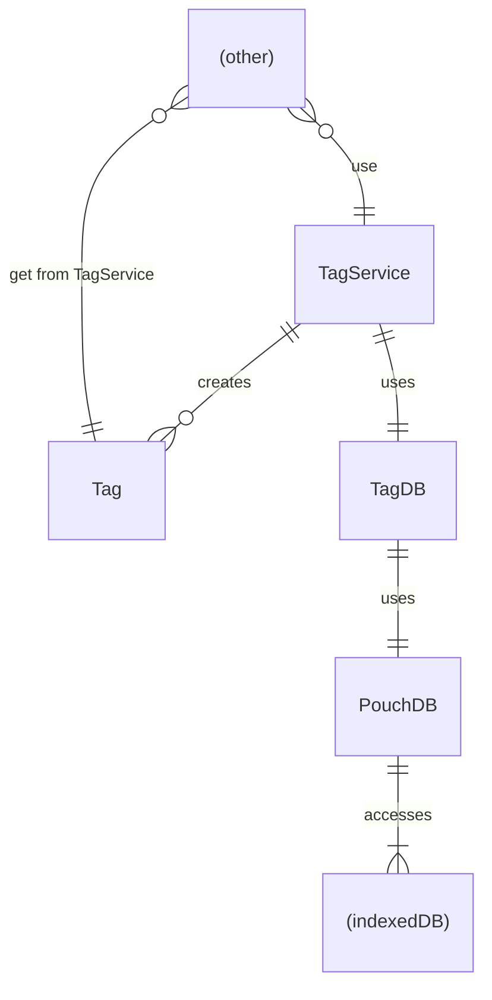

# Tag Data Architecture

Tags are stored locally in indexedDB and are being accessed through PouchDB.

## Classes and Services

### db/TagDB
This class stores and and acts as a facade for the PouchDB instance.
It handles some `_rev` logic when updating a Tag, loading the latest data before overriding the document.

### service/TagService
It is a CRUD facade for the `TagDB` API, caching the data in memory to allow for sync get callbacks.
The `TagService` always returns a `Tag` object.
For non-existing tags, it creates a new Tag with default values and the `'draft'` state.
It should be the only way to access tag data.
The `TagService` also provides a pubsub API to listen for changes to specific tags, using the PouchDB `watch` API.
(!) Only one TagService should exist at a time! One should be created during initialisation and then be injected and resolved through dependency injection.

### models/Tag
This class stores all data specific for a single Tag. It is a one-time snapshot of a tag state.
Tag data can be updated through the respective methods (except for the `name` itself) and can be used for the `TagService` API.

